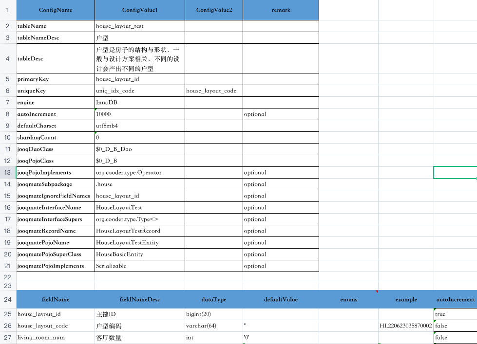

# jooq-mate


[](https://codecov.io/gh/cooder-org/jooq-mate)
[](https://search.maven.org/search?q=g:%22org.cooder%22%20AND%20a:%22jooq-mate%22)

## Quick Start

0、config (maven)  
add `jooq-mate-types` for using generated code.

```xml
<dependency>
  <groupId>org.cooder</groupId>
  <artifactId>jooq-mate-types</artifactId>
  <version>${version}</version>
</dependency>
```

add `jooq-mate-generator` for programmatic code generating.
```xml
<dependency>
  <groupId>org.cooder</groupId>
  <artifactId>jooq-mate-generator</artifactId>
  <version>${version}</version>
</dependency>
```

1、usage

- config your data models and jooq-mate settings. [config file template](./jooq-mate-generator/src/test/resources/jooq-mate-config.xlsx)

- generate db tables and code. 
```sh

java -jar jooq-mate-generator.jar -ct -jt <file>

//      <file>              Config file path
//      -ct, --createTable  Create tables in the specified database
//      -jc, --jooqCodegen  Generate jooq's Dao, Record, Pojo...

```

## Example
1. Suppose there is a `house_layout` data model as shown below: 


2. then running jooq-mate-generator.jar

if `-ct` was set, a `house_layout_test` table will be created.
```sql
CREATE TABLE `house_layout_test` (
  `house_layout_id` bigint(20) NOT NULL  AUTO_INCREMENT COMMENT '主键ID',
  `house_layout_code` varchar(64) NOT NULL DEFAULT ''  COMMENT '户型编码',
  `living_room_num` int NOT NULL DEFAULT '0'  COMMENT '客厅数量',
  `inside_area_value` decimal(10, 2) NOT NULL DEFAULT 0.00  COMMENT '套内面积',
  `status` int NOT NULL DEFAULT '1'  COMMENT '户型状态',
  `cu_name` varchar(32) NOT NULL DEFAULT ''  COMMENT '创建人',
  `cuid` bigint(20) NOT NULL DEFAULT '0'  COMMENT '创建人ID',
  `mu_name` varchar(32) NOT NULL DEFAULT ''  COMMENT '更新人',
  `muid` bigint(20) NOT NULL DEFAULT '0'  COMMENT '更新人ID',
  `ctime` timestamp NOT NULL DEFAULT CURRENT_TIMESTAMP  COMMENT '创建时间',
  `mtime` timestamp NOT NULL DEFAULT CURRENT_TIMESTAMP  COMMENT '更新时间',
  PRIMARY KEY (`house_layout_id`),
  UNIQUE KEY uniq_idx_code (`house_layout_code`)
) ENGINE=InnoDB AUTO_INCREMENT=10000 DEFAULT CHARSET=utf8mb4 COMMENT="户型是房子的结构与形状，一般与设计方案相关，不同的设计会产出不同的户型";
```

if `-jc` was set, jooq's Daos, Records, Pojos... will be generated.  


